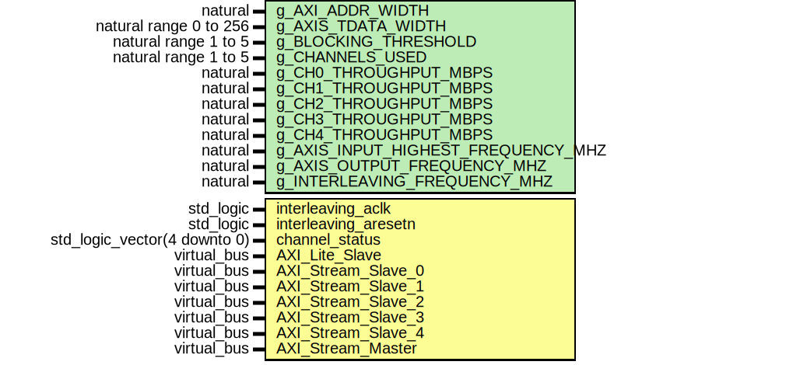

# Entity: axis_interleaving_top 
- **File**: axis_interleaving_top.vhd

## Diagram

## Description
- **Name:** axis_interleaving_top.vhd

- **Human Name:** Interleaving with AXI Steam interfaces

- **One-line Description:**  This module converts up to 5 AXI stream channels into a single one.

- **One-paragraph Description:**  This module converts up to 5 AXI stream channels into a single one. The AXI steam inputs must be the same width and conditions about frequencies must be also met. The core can be control via registers.

## axis_interleaving_top register space
### Overview
| OFFSET | LABEL                | DESCRIPTION               |
| ------ | -------------------- | ------------------------- |
| 0x0    | **version**          | IP version register       |
| 0x4    | **user_control**     | User control register     |
| 0x8    | **channel_status**   | Channel status register   |

### Registers
| OFFSET | LABEL                | R/W   | SC  | DESCRIPTION                                                                                         | RESET VALUE   |
| ------ | -------------------- | ----- | --- | --------------------------------------------------------------------------------------------------- | ------------- |
| 0x0    | **version**          |       |     |                                                                                                     |               |
|        | _[31:0] version_     | R     | NO  | Version value                                                                                       | 0x0           |
| 0x4    | **user_control**     |       |     |                                                                                                     |               |
|        | _[0:0] enable_       | R/W   | NO  | When '1' the core is controlled by the channel status. By default is '0'.                           | 0x0           |
|        | _[31:1] reserved_    | R/W   | NO  | Reserved                                                                                            | 0x0           |
| 0x8    | **channel_status**   |       |     |                                                                                                     |               |
|        | _[4:0] status_       | R/W   | NO  | Each bit indicates the status of each input channel. When '1' is enabled. By default is '0'.        | 0x0           |
|        | _[31:5] reserved_    | R/W   | NO  | Reserved                                                                                            | 0x0           |

## Generics
| Generic name                       | Type                   | Value | Description                                             |
| ---------------------------------- | ---------------------- | ----- | ------------------------------------------------------- |
| g_AXI_ADDR_WIDTH                   | natural                | 32    | width of the AXI lite address bus                       |
| g_AXIS_TDATA_WIDTH                 | natural range 0 to 256 | 32    | width of the AXI stream data bus                        |
| g_BLOCKING_THRESHOLD               | natural range 1 to 5   | 5     | number of channels that must be NOK to block the output |
| g_CHANNELS_USED                    | natural range 1 to 5   | 5     | number of channels used among the five available        |
| g_CH0_THROUGHPUT_MBPS              | natural                | 1000  | throughput in Mbps of channel 0                         |
| g_CH1_THROUGHPUT_MBPS              | natural                | 1000  | throughput in Mbps of channel 1                         |
| g_CH2_THROUGHPUT_MBPS              | natural                | 1000  | throughput in Mbps of channel 2                         |
| g_CH3_THROUGHPUT_MBPS              | natural                | 1000  | throughput in Mbps of channel 3                         |
| g_CH4_THROUGHPUT_MBPS              | natural                | 1000  | throughput in Mbps of channel 4                         |
| g_AXIS_INPUT_HIGHEST_FREQUENCY_MHZ | natural                | 100   | highest among the slave axi stream channels             |
| g_AXIS_OUTPUT_FREQUENCY_MHZ        | natural                | 100   | frequency of the master axi stream output               |
| g_INTERLEAVING_FREQUENCY_MHZ       | natural                | 500   | frequency of the interleaving                           |

## Ports
| Port name            | Direction | Type                         | Description                                                                                                  |
| -------------------- | --------- | ---------------------------- | ------------------------------------------------------------------------------------------------------------ |
| interleaving_aclk    | in        | std_logic                    |                                                                                                              |
| interleaving_aresetn | in        | std_logic                    |                                                                                                              |
| channel_status       | in        | std_logic_vector(4 downto 0) | Channel status. Bit n corresponds to channel n. When bit n is '1'/'0' means that channel n is enable/disable |
| AXI_Lite_Slave       | in        | Virtual bus                  |                                                                                                              |
| AXI_Stream_Slave_0   | in        | Virtual bus                  |                                                                                                              |
| AXI_Stream_Slave_1   | in        | Virtual bus                  |                                                                                                              |
| AXI_Stream_Slave_2   | in        | Virtual bus                  |                                                                                                              |
| AXI_Stream_Slave_3   | in        | Virtual bus                  |                                                                                                              |
| AXI_Stream_Slave_4   | in        | Virtual bus                  |                                                                                                              |
| AXI_Stream_Master    | in        | Virtual bus                  |                                                                                                              |

### Virtual Buses
#### AXI_Lite_Slave
| Port name     | Direction | Type                                            | Description |
| ------------- | --------- | ----------------------------------------------- | ----------- |
| axi_aclk      | in        | std_logic                                       |             |
| axi_aresetn   | in        | std_logic                                       |             |
| s_axi_awaddr  | in        | std_logic_vector(g_AXI_ADDR_WIDTH - 1 downto 0) |             |
| s_axi_awprot  | in        | std_logic_vector(2 downto 0)                    |             |
| s_axi_awvalid | in        | std_logic                                       |             |
| s_axi_awready | out       | std_logic                                       |             |
| s_axi_wdata   | in        | std_logic_vector(31 downto 0)                   |             |
| s_axi_wstrb   | in        | std_logic_vector(3 downto 0)                    |             |
| s_axi_wvalid  | in        | std_logic                                       |             |
| s_axi_wready  | out       | std_logic                                       |             |
| s_axi_araddr  | in        | std_logic_vector(g_AXI_ADDR_WIDTH - 1 downto 0) |             |
| s_axi_arprot  | in        | std_logic_vector(2 downto 0)                    |             |
| s_axi_arvalid | in        | std_logic                                       |             |
| s_axi_arready | out       | std_logic                                       |             |
| s_axi_rdata   | out       | std_logic_vector(31 downto 0)                   |             |
| s_axi_rresp   | out       | std_logic_vector(1 downto 0)                    |             |
| s_axi_rvalid  | out       | std_logic                                       |             |
| s_axi_rready  | in        | std_logic                                       |             |
| s_axi_bresp   | out       | std_logic_vector(1 downto 0)                    |             |
| s_axi_bvalid  | out       | std_logic                                       |             |
| s_axi_bready  | in        | std_logic                                       |             |

#### AXI_Stream_Slave_0
| Port name       | Direction | Type                                            | Description |
| --------------- | --------- | ----------------------------------------------- | ----------- |
| s0_axis_aclk    | in        | std_logic                                       |             |
| s0_axis_aresetn | in        | std_logic                                       |             |
| s0_axis_tdata   | in        | std_logic_vector(g_AXIS_TDATA_WIDTH-1 downto 0) |             |
| s0_axis_tvalid  | in        | std_logic                                       |             |
| s0_axis_tready  | out       | std_logic                                       |             |

#### AXI_Stream_Slave_1
| Port name       | Direction | Type                                            | Description |
| --------------- | --------- | ----------------------------------------------- | ----------- |
| s1_axis_aclk    | in        | std_logic                                       |             |
| s1_axis_aresetn | in        | std_logic                                       |             |
| s1_axis_tvalid  | in        | std_logic                                       |             |
| s1_axis_tdata   | in        | std_logic_vector(g_AXIS_TDATA_WIDTH-1 downto 0) |             |
| s1_axis_tready  | out       | std_logic                                       |             |

#### AXI_Stream_Slave_2
| Port name       | Direction | Type                                            | Description |
| --------------- | --------- | ----------------------------------------------- | ----------- |
| s2_axis_aclk    | in        | std_logic                                       |             |
| s2_axis_aresetn | in        | std_logic                                       |             |
| s2_axis_tvalid  | in        | std_logic                                       |             |
| s2_axis_tdata   | in        | std_logic_vector(g_AXIS_TDATA_WIDTH-1 downto 0) |             |
| s2_axis_tready  | out       | std_logic                                       |             |

#### AXI_Stream_Slave_3
| Port name       | Direction | Type                                            | Description |
| --------------- | --------- | ----------------------------------------------- | ----------- |
| s3_axis_aclk    | in        | std_logic                                       |             |
| s3_axis_aresetn | in        | std_logic                                       |             |
| s3_axis_tvalid  | in        | std_logic                                       |             |
| s3_axis_tdata   | in        | std_logic_vector(g_AXIS_TDATA_WIDTH-1 downto 0) |             |
| s3_axis_tready  | out       | std_logic                                       |             |

#### AXI_Stream_Slave_4
| Port name       | Direction | Type                                            | Description |
| --------------- | --------- | ----------------------------------------------- | ----------- |
| s4_axis_aclk    | in        | std_logic                                       |             |
| s4_axis_aresetn | in        | std_logic                                       |             |
| s4_axis_tvalid  | in        | std_logic                                       |             |
| s4_axis_tdata   | in        | std_logic_vector(g_AXIS_TDATA_WIDTH-1 downto 0) |             |
| s4_axis_tready  | out       | std_logic                                       |             |

#### AXI_Stream_Master
| Port name      | Direction | Type                                            | Description |
| -------------- | --------- | ----------------------------------------------- | ----------- |
| m_axis_aclk    | in        | std_logic                                       |             |
| m_axis_aresetn | in        | std_logic                                       |             |
| m_axis_tvalid  | out       | std_logic                                       |             |
| m_axis_tdata   | out       | std_logic_vector(g_AXIS_TDATA_WIDTH-1 downto 0) |             |
| m_axis_tready  | in        | std_logic                                       |             |

## Signals
| Name                             | Type                                                | Description |
| -------------------------------- | --------------------------------------------------- | ----------- |
| s_user2regs                      | t_user2regs                                         |             |
| s_regs2user                      | t_regs2user                                         |             |
| s_user_control_from_reg          | std_logic                                           |             |
| s_channel_status_from_reg        | std_logic_vector(c_CHANNEL_STATUS_WIDTH-1 downto 0) |             |
| s_channel_status_from_input      | std_logic_vector(c_CHANNEL_STATUS_WIDTH-1 downto 0) |             |
| s_user_control_from_reg_fast     | std_logic                                           |             |
| s_channel_status_from_reg_fast   | std_logic_vector(c_CHANNEL_STATUS_WIDTH-1 downto 0) |             |
| s_channel_status_from_input_fast | std_logic_vector(c_CHANNEL_STATUS_WIDTH-1 downto 0) |             |
| s0_axis_tdata_fast               | std_logic_vector(g_AXIS_TDATA_WIDTH-1 downto 0)     |             |
| s0_axis_tvalid_fast              | std_logic                                           |             |
| s0_axis_tready_fast              | std_logic                                           |             |
| s1_axis_tdata_fast               | std_logic_vector(g_AXIS_TDATA_WIDTH-1 downto 0)     |             |
| s1_axis_tvalid_fast              | std_logic                                           |             |
| s1_axis_tready_fast              | std_logic                                           |             |
| s2_axis_tdata_fast               | std_logic_vector(g_AXIS_TDATA_WIDTH-1 downto 0)     |             |
| s2_axis_tvalid_fast              | std_logic                                           |             |
| s2_axis_tready_fast              | std_logic                                           |             |
| s3_axis_tdata_fast               | std_logic_vector(g_AXIS_TDATA_WIDTH-1 downto 0)     |             |
| s3_axis_tvalid_fast              | std_logic                                           |             |
| s3_axis_tready_fast              | std_logic                                           |             |
| s4_axis_tdata_fast               | std_logic_vector(g_AXIS_TDATA_WIDTH-1 downto 0)     |             |
| s4_axis_tvalid_fast              | std_logic                                           |             |
| s4_axis_tready_fast              | std_logic                                           |             |
| m_axis_tdata_fast                | std_logic_vector(g_AXIS_TDATA_WIDTH-1 downto 0)     |             |
| m_axis_tvalid_fast               | std_logic                                           |             |
| m_axis_tready_fast               | std_logic                                           |             |
| s_m_demanding_data_fast          | std_logic                                           |             |
| s_m_demanding_data               | std_logic                                           |             |

## Constants
| Name                   | Type    | Value | Description |
| ---------------------- | ------- | ----- | ----------- |
| c_CHANNEL_STATUS_WIDTH | integer | 5     |             |
| c_DEST_SYNC_FF         | integer | 4     |             |
| c_SRC_INPUT_REG        | integer | 1     |             |

## Functions
- check_interleaving_clk_condition (interleaving_freq,  s_axis_freq,  channels_in_used : natural) return boolean
- check_m_axis_clk_condition (m_axis_freq,  thr_ch0,  thr_ch1,  thr_ch2,  thr_3,  thr_ch4,  s_axis_tdata_width,  channels_in_used : natural) return boolean

## Instantiations
- registers_inst: work.axis_interleaving_regs
- cdc_user_control_reg_inst: work.bit_cdc
- cdc_channel_status_reg_inst: work.gray_cdc
- cdc_channel_status_input_inst: work.gray_cdc
- axi_stream_fifo_inst_0: work.axi_stream_fifo
- axi_stream_fifo_inst_1: work.axi_stream_fifo
- axi_stream_fifo_inst_2: work.axi_stream_fifo
- axi_stream_fifo_inst_3: work.axi_stream_fifo
- axi_stream_fifo_inst_4: work.axi_stream_fifo
- interleaving_inst: work.axis_interleaving
- axi_stream_fifo_inst_5: work.axi_stream_fifo
- demanding_data_cdc_inst: work.bit_cdc